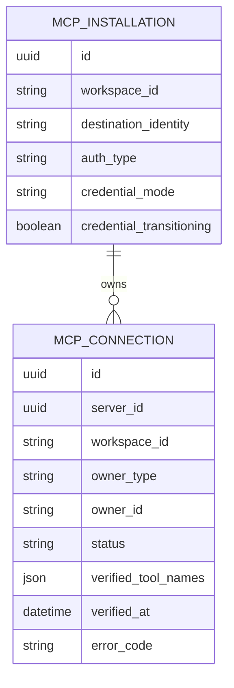
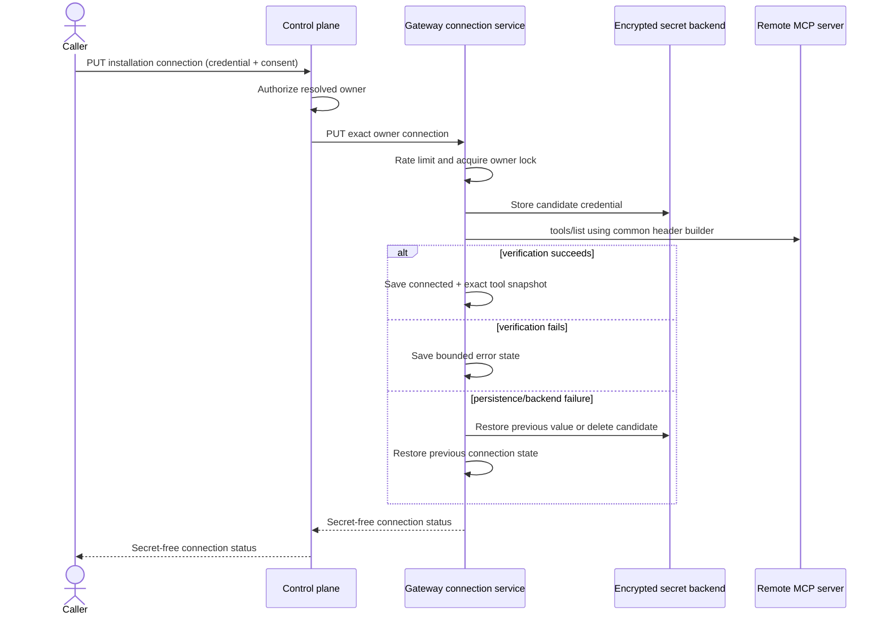
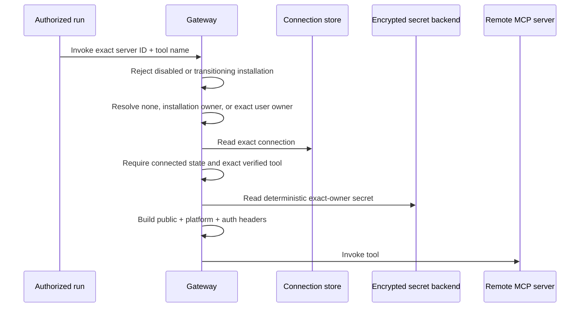
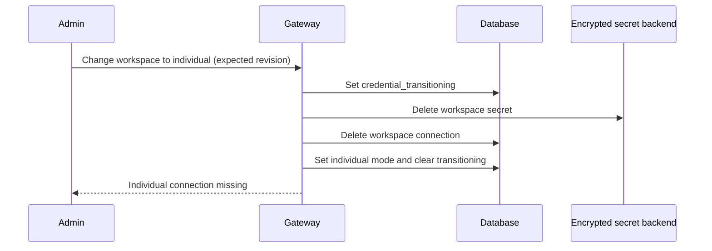
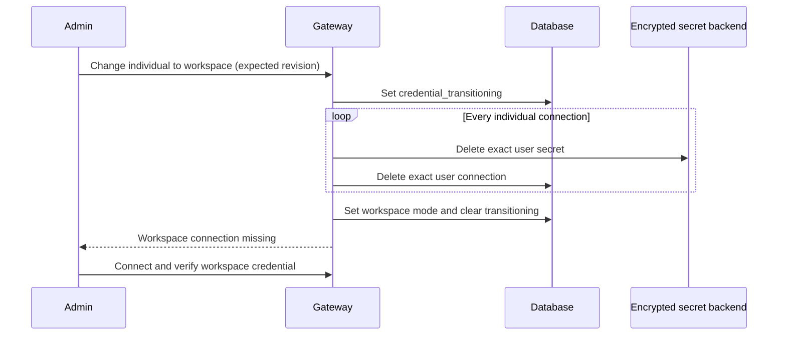

# MCP credential ownership decision record

## Decision

Authenticated MCP installations use one explicit `credential_mode`: `workspace`
or `individual`. Unauthenticated installations use `none`. Authentication
format (`auth_type`) remains independent from ownership.

- Workspace connections use the canonical installation owner and require
  `manage_mcp` for mutation. User and service-identity runs may resolve them.
- Individual connections use the exact authenticated user ID. Only that user
  may mutate or resolve the connection; service identities fail closed.
- There is no fallback between owner types and no public connection inventory.
- Catalog endpoints may restrict supported modes and recommend a default.
- Connection responses expose mode, status, management scope, permission, and
  auth format only. They never expose secret names, values, owner IDs, or tool
  snapshots.
- Workspace credentials should be dedicated least-privilege service or bot
  credentials. Individual credentials remain invisible to administrators.
- `manage_mcp` is the initial workspace-credential permission. A dedicated
  permission can be introduced after a separate authorization review.
- Public connection timestamps are omitted from the initial contract.

## Storage model



The plaintext value exists only in the configured encrypted secret backend. Its
deterministic identity is:

```text
mcp_credential::{workspace_id}::{server_id}::installation
mcp_credential::{workspace_id}::{server_id}::user::{user_id}
```

The database stores no arbitrary secret reference. `verified_tool_names` is a
credential-specific authorization snapshot, not a second installation catalog.

## Connection lifecycle



Verify repeats authenticated discovery with the stored exact-owner credential.
Disconnect acquires the same owner lock, deletes that deterministic secret, and
then deletes its connection row. Installation deletion enumerates every owner,
attempts each secret deletion, and only then removes installation metadata.

## Runtime resolution



`individual` plus a non-user principal returns
`MCP_INDIVIDUAL_USER_PRINCIPAL_REQUIRED`. Missing, erroneous, or tool-incomplete
connections fail before contacting the remote server.

Interactive target chat may degrade by omitting credential-dependent MCP tools
whose exact connection is missing, erroneous, or tool-incomplete for the pinned
user. The same tools are removed from model schemas and run-token authority, and
the capability preview reports the omission. An explicitly referenced tool,
installation-level failure, workflow, schedule, or automation remains
fail-closed.

## Ownership transitions

Relational metadata and the encrypted secret backend cannot share one atomic
transaction. The gateway therefore sets `credential_transitioning` before
cleanup. Readiness, connection mutation, and runtime invocation reject a
transitioning installation. If cleanup fails, the flag remains set and the
installation stays blocked for an explicit retry; old credentials never become
fallback candidates.





The management console confirms both destructive transitions and immediately
opens the existing credential dialog for the new owner mode. Until connection
verification succeeds, fail-closed workflows, schedules, automations, and
explicit tool references remain blocked. Interactive target chat may proceed
without the unavailable installation tools.

## Security invariants

- Credential plaintext is accepted only by connection mutation, never by MCP
  installation create/update.
- Verification and runtime use the same header builder and validated ordering:
  public headers, platform headers, then authentication.
- Credentials, resulting authentication headers, secret references, owner IDs,
  upstream error bodies, and verified-tool snapshots are excluded from public
  responses, audit metadata, and structured logs.
- Connect and verify share one owner-scoped mutation quota. Redis is the
  production limiter; an in-memory implementation is the development/test
  fallback.
- URL, authentication metadata, public-header, catalog-trust, and ownership
  changes invalidate connections under a fail-closed transition.
